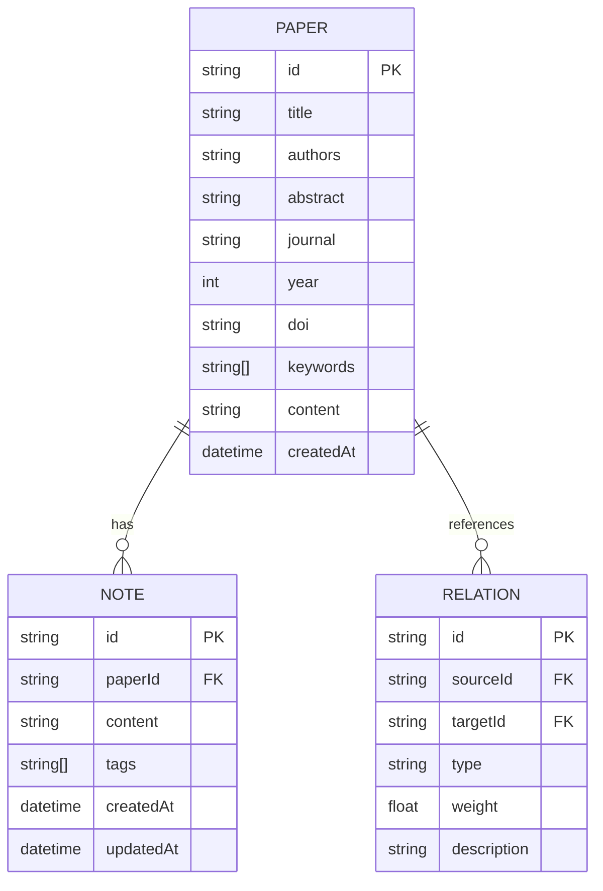

## 1. Architecture Design

```mermaid
graph TB
    subgraph Frontend["前端层 (React)"]
        A[页面组件] --> B[状态管理 Zustand]
        A --> C[路由管理 React Router]
        B --> D[数据可视化 D3.js]
        A --> E[3D渲染 Three.js]
    end
    
    subgraph Services["服务层"]
        F[论文解析服务]
        G[知识图谱构建]
        H[文本分析服务]
    end
    
    subgraph Storage["数据存储"]
        I[LocalStorage]
        J[IndexedDB]
    end
    
    Frontend --&gt; Services
    Services --&gt; Storage
```

## 2. Technology Description
- **前端**: React@18 + TypeScript@5 + Vite@5 + TailwindCSS@3
- **初始化工具**: vite-init
- **后端**: 前端一体化架构，使用浏览器端API处理
- **数据存储**: LocalStorage + IndexedDB（客户端存储）
- **数据可视化**: D3.js@7 + Recharts@2
- **3D渲染**: Three.js@0.160 + @react-three/fiber@8
- **状态管理**: Zustand@4
- **路由**: React Router@6
- **图标库**: Lucide React

## 3. Route Definitions
| Route | Purpose |
|-------|---------|
| / | 首页 - 英雄区、功能介绍、上传入口 |
| /analyze | 论文分析页 - 论文解析和分析展示 |
| /graph | 知识图谱页 - 交互式知识图谱探索 |
| /workbench | 研究工作台 - 文献管理和笔记系统 |

## 4. Data Model

### 4.1 Data Model Definition


### 4.2 TypeScript Interfaces
```typescript
interface Paper {
  id: string;
  title: string;
  authors: string;
  abstract: string;
  journal: string;
  year: number;
  doi: string;
  keywords: string[];
  content: string;
  createdAt: Date;
}

interface Note {
  id: string;
  paperId: string;
  content: string;
  tags: string[];
  createdAt: Date;
  updatedAt: Date;
}

interface Relation {
  id: string;
  sourceId: string;
  targetId: string;
  type: 'citation' | 'similarity' | 'co-author';
  weight: number;
  description: string;
}

interface GraphNode {
  id: string;
  label: string;
  type: 'paper' | 'author' | 'keyword';
  size: number;
  data: Paper | null;
}

interface GraphLink {
  source: string;
  target: string;
  type: string;
  value: number;
}
```

## 5. State Management (Zustand)
```typescript
interface AppState {
  papers: Paper[];
  currentPaper: Paper | null;
  notes: Note[];
  graphData: { nodes: GraphNode[]; links: GraphLink[] };
  addPaper: (paper: Omit&lt;Paper, 'id' | 'createdAt'&gt;) =&gt; void;
  setCurrentPaper: (paper: Paper | null) =&gt; void;
  addNote: (note: Omit&lt;Note, 'id' | 'createdAt' | 'updatedAt'&gt;) =&gt; void;
  updateGraph: () =&gt; void;
}
```

## 6. File Structure
```
/workspace
├── src/
│   ├── components/
│   │   ├── layout/
│   │   │   ├── Header.tsx
│   │   │   ├── Footer.tsx
│   │   │   └── Sidebar.tsx
│   │   ├── features/
│   │   │   ├── PaperUploader.tsx
│   │   │   ├── PaperAnalyzer.tsx
│   │   │   ├── KnowledgeGraph.tsx
│   │   │   └── NoteEditor.tsx
│   │   └── ui/
│   │       ├── Button.tsx
│   │       ├── Card.tsx
│   │       └── Input.tsx
│   ├── pages/
│   │   ├── Home.tsx
│   │   ├── Analyze.tsx
│   │   ├── Graph.tsx
│   │   └── Workbench.tsx
│   ├── hooks/
│   │   ├── usePaperAnalysis.ts
│   │   └── useKnowledgeGraph.ts
│   ├── store/
│   │   └── useAppStore.ts
│   ├── utils/
│   │   ├── paperParser.ts
│   │   ├── textAnalyzer.ts
│   │   └── graphBuilder.ts
│   ├── types/
│   │   └── index.ts
│   ├── App.tsx
│   └── main.tsx
├── public/
├── package.json
├── vite.config.ts
├── tailwind.config.js
└── tsconfig.json
```
